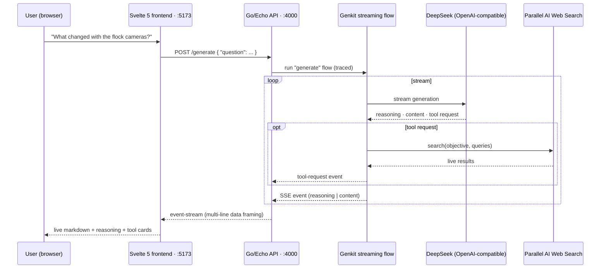

# 🔍 Uncover

### Ask anything. Watch the reasoning. See where the answer came from.

**Uncover** is an AI research companion that doesn't just hand you an answer — it streams its **reasoning**, shows the **live web searches** it runs, and then writes you a grounded, markdown-formatted answer. Built for **[Hack The Limit](https://hack-the-limit-1.devpost.com/)** — an open-ended hackathon to take an idea from scratch to something real.

> *"Good Afternoon, Jason. What do you want to uncover today?"*


---

## The Problem

LLM chat apps answer confidently — and often **wrong**, with no way to check their work. When you're researching something that matters (a breaking news story, a product decision, a study), you need more than a confident paragraph. You need:

- **Evidence** — did the model actually look anything up, or is it guessing?
- **Reasoning** — *how* did it get from question to answer?
- **Timeliness** — most models are trained on old data and can't see what changed today.

Typical chat UIs hide all of this. The thinking happens in a black box, citations are an afterthought, and outdated knowledge is presented with the same confidence as verified facts.

## The Idea

**Uncover flips the black box open.** Instead of hiding the model's work, it broadcasts it in real time:

1. You ask a question.
2. The model **thinks out loud** — its reasoning streams onto the screen as it happens.
3. When it decides it needs fresh information, it **calls a live web-search tool**, and you see exactly what it searched for.
4. The final answer streams in as **rendered markdown**, grounded in what it found.

You don't just get the answer — you get the **whole investigation**, live.

## Key Features

- ⚡ **True token streaming** — answers, reasoning, and tool activity arrive token-by-token over SSE; paragraphs and markdown structure are preserved losslessly through the wire.
- 🧠 **Visible reasoning** — the model's chain-of-thought streams in a distinct, muted panel above the answer.
- 🔎 **Live research tool** — the model can invoke a real web-search API (Parallel AI) mid-conversation; the queries it runs appear as a rendered tool card.
- 📝 **Markdown answers** — headings, lists, code, quotes, and tables render as the tokens arrive.
- 💬 **Conversation history** — user questions and assistant answers build into a scrollable thread, with the latest answer streaming in place.
- ⏳ **Honest loading states** — a spinner in the send button and a "thinking" indicator tell you the model is working; Enter sends, Shift+Enter newlines.
- 🧭 **Clean app shell** — sidebar navigation with tooltips, searchable thread header, and a branded empty state.

## How It Works



**The wire format matters.** SSE can't carry raw newlines inside a `data:` line, so the backend emits multi-line payloads as repeated `data:` fields — the spec-compliant framing that lets the client reconstruct newlines losslessly. The frontend never has to guess where line breaks were.

**Backend** — Go 1.26 · Echo · Firebase Genkit streaming flow (traced & debuggable in the Genkit Dev UI) · DeepSeek via the OpenAI-compatible plugin · a `search` tool wrapping the Parallel AI search API · godotenv config · `air` hot-reload.

**Frontend** — Svelte 5 (runes) · Tailwind CSS v4 · Vite · `@microsoft/fetch-event-source` · `markdown-it` · iconify icon sets.

## Getting Started

### Prerequisites

- **Go 1.26+** and **[air](https://github.com/air-verse/air)** (backend hot reload) — or just `go run`
- **pnpm** (frontend)
- API keys: a **DeepSeek** (OpenAI-compatible) key and a **Parallel AI** search key

### 1. Clone & configure the backend

```bash
git clone git@github.com:ezek-iel/uncover.git
cd uncover/backend

cp .env.example .env   # then fill in your keys
```

| Variable | Required | Description |
| --- | --- | --- |
| `OPENAI_API_KEY` | ✅ | DeepSeek API key (OpenAI-compatible) |
| `OPENAI_BASE_URL` | ✅ | DeepSeek endpoint, e.g. `https://api.deepseek.com` |
| `OPENAI_MODEL` | ✅ | e.g. `deepseek-chat` |
| `PARALLEL_API_KEY` | ✅ | Parallel AI search API key |
| `DEEPSEEK_MODEL` | ⬜ | Optional model override |

### 2. Run the backend

```bash
cd backend
air                 # hot-reload dev server → http://localhost:4000
```

*(or `go run ./cmd/api`)*

### 3. Run the frontend

```bash
cd frontend
pnpm install
pnpm dev            # → http://localhost:5173
```

Open http://localhost:5173 and ask anything. Watch the reasoning stream in, the search tool fire, and the answer render.

## Project Structure

```
uncover/
├── backend/                    # Go + Genkit API
│   ├── cmd/api/
│   │   ├── main.go             # Echo server, CORS, genkit init, tool wiring
│   │   ├── handlers.go         # SSE endpoint (/generate)
│   │   ├── ai.go               # genkit streaming flow + SSE event framing
│   │   └── tools.go            # Parallel AI search tool
│   ├── .air.toml               # hot reload config
│   └── .env.example            # API key template
└── frontend/                   # Svelte 5 + Tailwind v4 app
    └── src/
        ├── App.svelte          # app shell (sidebar + topbar + chat)
        └── lib/
            ├── components/     # Chat, ChatInput, MessageBubble, Sidebar, Topbar
            └── utils/          # SSE client (fetch.ts), token/markdown rendering (actions.ts)
```

## Target Users

- **Students & journalists** researching topics where freshness and evidence matter
- **Analysts & product folks** doing quick competitive or market research
- **Curious people** who want to see *how* an AI reaches a conclusion — not just the conclusion

## What's Next

- **Multi-turn memory** — the backend currently answers each question independently; wiring conversation context into the Genkit flow turns Uncover into a real research session
- **Cited sources** — surface the actual URLs behind each search result
- **Persistent threads** — save, search, and resume past conversations (the "previous chats" nav is already in the shell)
- **Search progress UI** — show results streaming back, not just the outgoing query

---

Built with 🧠 for **[Hack The Limit](https://hack-the-limit-1.devpost.com/)** · Open-ended hackathon · Students only
