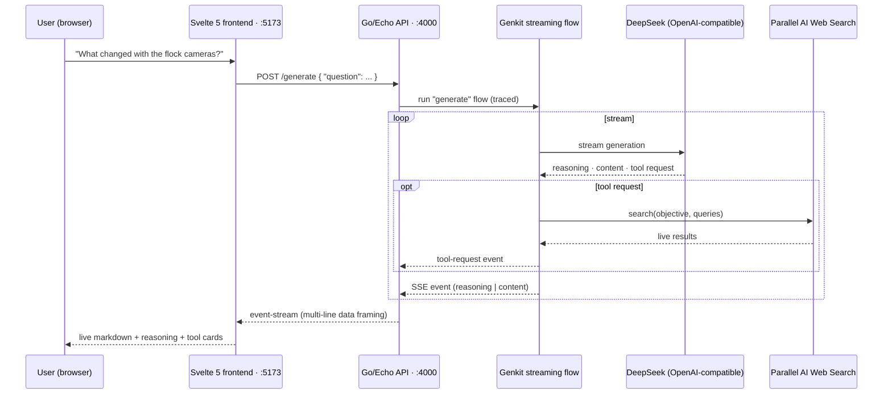

# 🔍 Uncover

### Ask anything. Watch the reasoning. See where the answer came from.

**Uncover** is an AI research companion that doesn't just hand you an answer — it streams its **reasoning**, shows the **live web searches** it runs, and then writes you a grounded, markdown-formatted answer. Built for **[Hack The Limit](https://hack-the-limit-1.devpost.com/)** — an open-ended hackathon to take an idea from scratch to something real.

> *"Good Afternoon, Jason. What do you want to uncover today?"*


---

## The Problem

LLMs answer their questions with an air of certainty, but they are also often flat-out wrong, and there's no way to verify that what they are saying is accurate. If you are investigating something that truly matters (a developing news story, a purchasing decision, an academic study), an LLM's paragraph isn't good enough. What you need are the:

- **Evidence**: Does the LLM seem to know for a fact that it actually looked something up, or could it simply be guessing?
- **Reasoning**: How does the LLM come to this conclusion based on your question?
- **Timeliness**: Most LLM models, trained on older data sets, don’t know that it’s 2024 and don't know what’s just happened in the last hour or last year.

Most of the chat UIs on existing platforms just hide the evidence, reasoning, and timeline information and provide the LLM’s confident answer – without transparency.

## The Idea

Uncover opens the black box. Rather than conceal what the model is doing, it reveals it:

1. You make a request.

2. The model thinks out loud - its reasoning pours out as it works - which is streamed.
3. When the model feels that a piece of evidence is missing, it invokes a live web-search tool and you see the exact search query it made.
4. Then the final answer is streamed as rendered markdown, based on what was retrieved.

You don't just get the answer, you get the entire investigation, live.

## Key Features
- ⚡ **True token streaming**: Answers, reasoning, and tool actions come over the wire as SSE token-by-token, fully preserving paragraphs and markdown structure.  

- 🧠 **Visible reasoning**: A chain-of-thought streams from the model in a different, subdued panel above the answer.  

- 🔎 **Live research tool**: The model can call a real web-search tool (Parallel AI) during the conversation and display rendered tool cards for each query.  

- 📝 **Markdown answers**: Headlines, lists, code snippets, quotes and tables stream and are rendered as tokens arrive.  

- 💬 **Conversation history**: Previous turns of conversation with the model appear in a scrollable list below the ongoing stream.  

- ⏳ **Honest loading states**: You'll see a spinner on the send button and a “thinking” status, and pressing Enter sends, while Shift-Enter inserts a newline.  

- 🧭 **Clean app shell**: Sidebar navigation with tooltips, a searchable question history at the top of the page, and a branded experience when no threads have been created yet.

## How It Works



**The wire format matters.** SSE can't carry raw newlines inside a `data:` line, so the backend emits multi-line payloads as repeated `data:` fields — the spec-compliant framing that lets the client reconstruct newlines losslessly. The frontend never has to guess where line breaks were.

**Backend** — Go 1.26 · Echo · Firebase Genkit streaming flow (traced & debuggable in the Genkit Dev UI) · DeepSeek via the OpenAI-compatible plugin · a `search` tool wrapping the Parallel AI search API · godotenv config · `air` hot-reload.

**Frontend** — Svelte 5 (runes) · Tailwind CSS v4 · Vite · `@microsoft/fetch-event-source` · `markdown-it` · iconify icon sets.

## Getting Started

### Prerequisites

- **Go 1.26+** and **[air](https://github.com/air-verse/air)** (backend hot reload) — or just `go run`
- **pnpm** (frontend)
- API keys: a **DeepSeek** (OpenAI-compatible) key and a **Parallel AI** search key

### 1. Clone & configure the backend

```bash
git clone git@github.com:ezek-iel/uncover.git
cd uncover/backend

cp .env.example .env   # then fill in your keys
```

| Variable | Required | Description |
| --- | --- | --- |
| `OPENAI_API_KEY` | ✅ | DeepSeek API key (OpenAI-compatible) |
| `OPENAI_BASE_URL` | ✅ | DeepSeek endpoint, e.g. `https://api.deepseek.com` |
| `OPENAI_MODEL` | ✅ | e.g. `deepseek-chat` |
| `PARALLEL_API_KEY` | ✅ | Parallel AI search API key |
| `DEEPSEEK_MODEL` | ⬜ | Optional model override |

### 2. Run the backend

```bash
cd backend
air                 # hot-reload dev server → http://localhost:4000
```

*(or `go run ./cmd/api`)*

### 3. Run the frontend

```bash
cd frontend
pnpm install
pnpm dev            # → http://localhost:5173
```

Open http://localhost:5173 and ask anything. Watch the reasoning stream in, the search tool fire, and the answer render.

## Project Structure

```
uncover/
├── backend/                    # Go + Genkit API
│   ├── cmd/api/
│   │   ├── main.go             # Echo server, CORS, genkit init, tool wiring
│   │   ├── handlers.go         # SSE endpoint (/generate)
│   │   ├── ai.go               # genkit streaming flow + SSE event framing
│   │   └── tools.go            # Parallel AI search tool
│   ├── .air.toml               # hot reload config
│   └── .env.example            # API key template
└── frontend/                   # Svelte 5 + Tailwind v4 app
    └── src/
        ├── App.svelte          # app shell (sidebar + topbar + chat)
        └── lib/
            ├── components/     # Chat, ChatInput, MessageBubble, Sidebar, Topbar
            └── utils/          # SSE client (fetch.ts), token/markdown rendering (actions.ts)
```

## Target Users

- **Students & journalists** researching topics where freshness and evidence matter
- **Analysts & product folks** doing quick competitive or market research
- **Curious people** who want to see *how* an AI reaches a conclusion — not just the conclusion

## What's Next

- **Multi-turn memory** — the backend currently answers each question independently; wiring conversation context into the Genkit flow turns Uncover into a real research session
- **Cited sources** — surface the actual URLs behind each search result
- **Persistent threads** — save, search, and resume past conversations (the "previous chats" nav is already in the shell)
- **Search progress UI** — show results streaming back, not just the outgoing query

---

Built with 🧠 for **[Hack The Limit](https://hack-the-limit-1.devpost.com/)** · Open-ended hackathon · Students only
